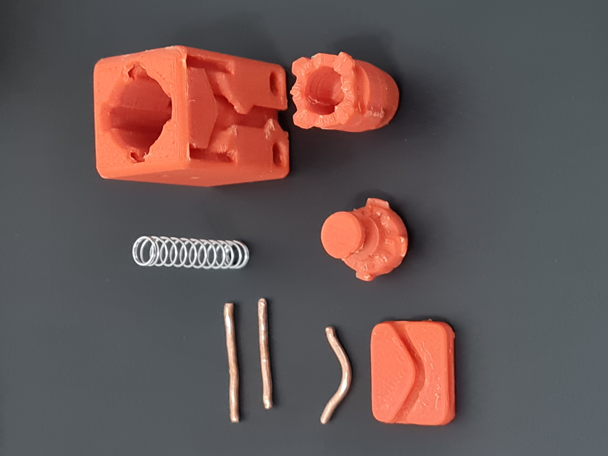
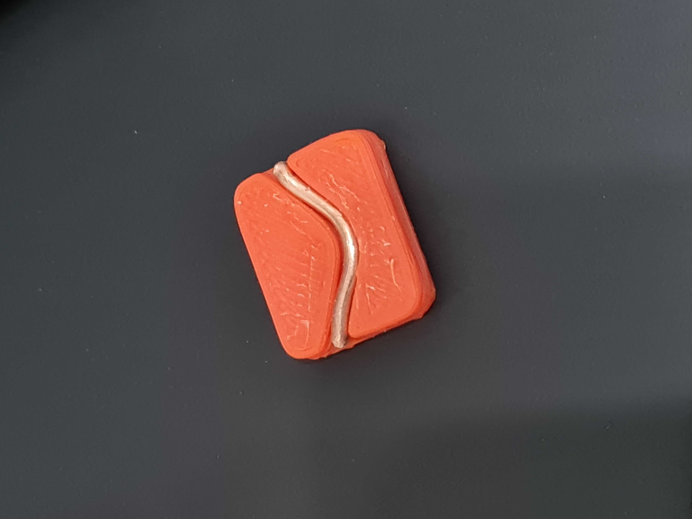
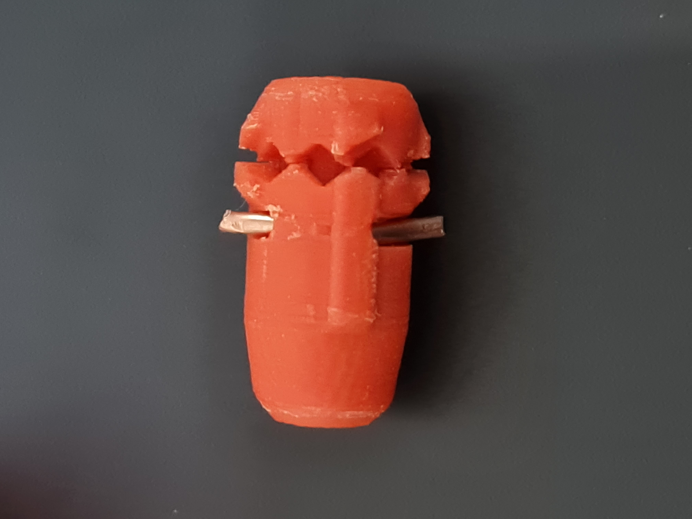
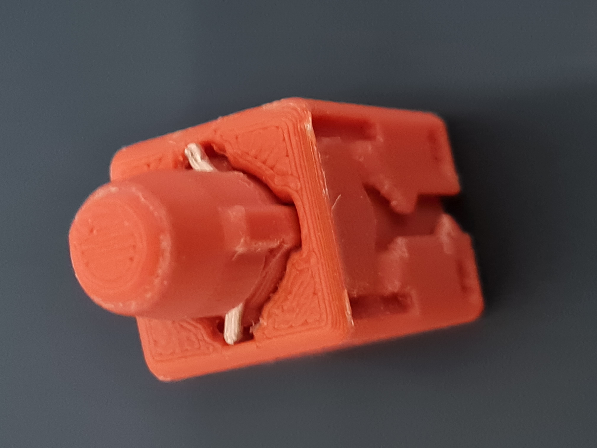
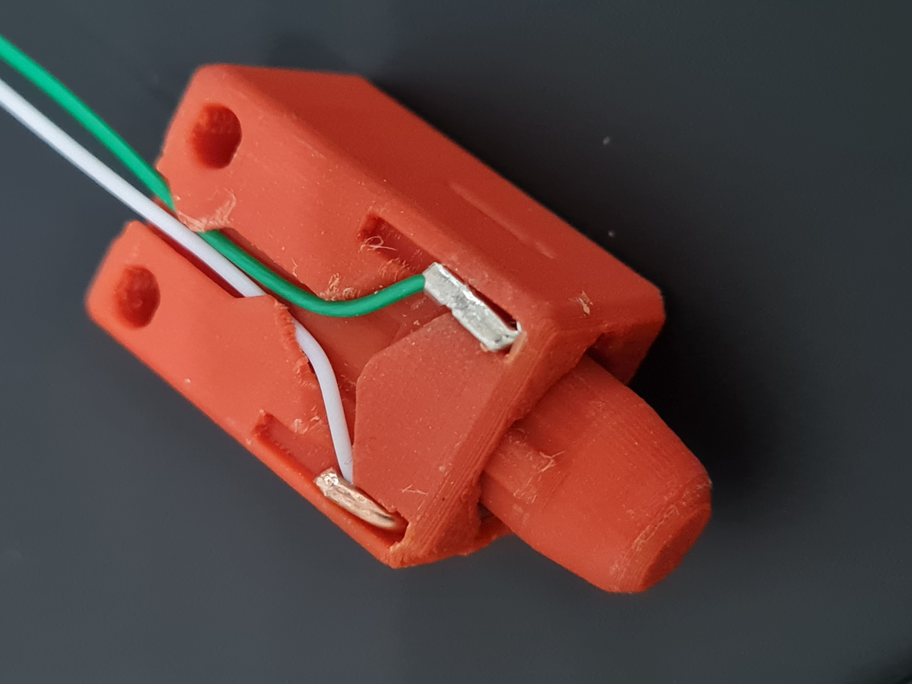
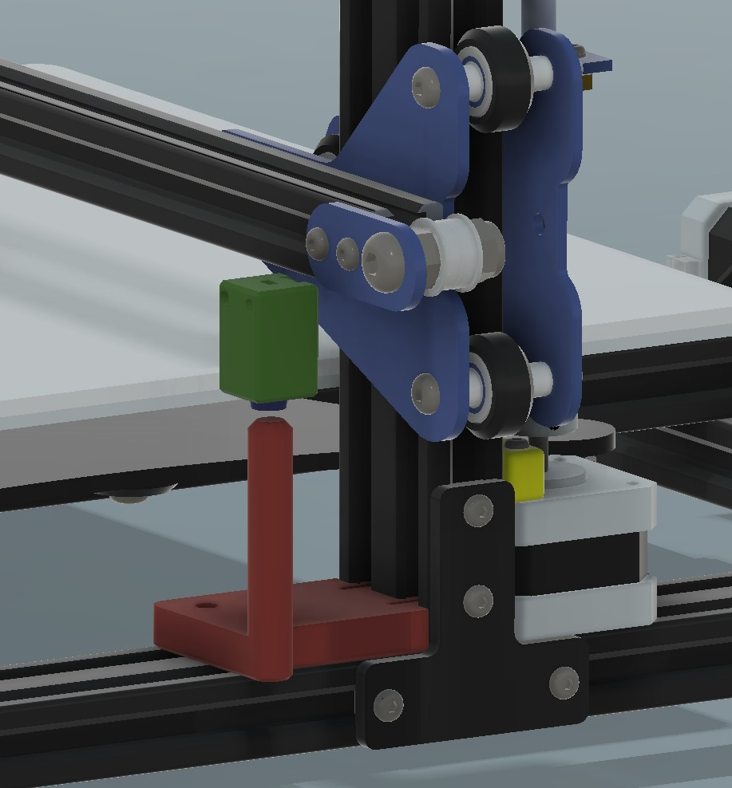

# Latchy Probe

A 3D printable alternative to the Omron TL-Q5MC2 inductive sensor commonly used on FDM printers for bed leveling.

Having a printer with no auto bed leveling is frustrating. While BL-Touch is a common choice, inductive probes are simple off-the-shelf items. Klicky and Unklicky probes can be printed but need magnets. What if there was an alternative that you could easily print and only needs a few parts that you probably already have?

The inspiration for this is the Klicky probe (and other similar devices) that have led the way. The objectives for this project are almost identical to the Klicky objectives: [Klicky Probe Objectives](https://github.com/jlas1/Klicky-Probe/blob/main/README.md).

## Objectives
- Drop-in replacement for Omron TL-Q5MC2 or PL-08N2 (no need to replace the toolhead)
- No soldering required
- Minimal adjustments required
- Detect all print surfaces
- Close to the hotend tip
- Highly repeatable and accurate
- Less temperature variation
- No melting of parts
- Cheap to build
- Reuse spare parts if possible

## Additional Features
- Uses common items found at home, no special parts needed
- Does not reduce the printable area
- No detachable parts

The Latchy Probe has been developed over many months, with dozens of prototypes and 3 full test versions. It has been tested on a Creality CR10 (my Voron is still in the pipeline) and works well. The design is optimized for FDM printing but can be miniaturized using resin printing. Feedback is always welcome here or on Discord (crashysmashy1).

If you want to support this project, please consider donating [here](https://paypal.me/CrashySmashy?country.x=GB&locale.x=en_GB).

## Presenting the Latchy Probe

Latchy Probe is a direct size-for-size replacement for the Omron TL-Q5MC2 inductive probe, allowing it to use the same mounting points and adaptors for many printers.

### Features
- Physical contact switch of the same size as the inductive probe
- Deployed using the 3D printer’s motion system, like Klicky
- Similar internal contacts to Unklicky, but without detachable parts
- Probe tip retracts when not in use, similar to BLTouch
- Cheap, accurate, and can be built at home using parts from a retractable pen

Electrically, it uses only 2 wires that can be connected to the probe input on controller boards, with no external signals or power connections needed. The probe circuit is fail-safe, as it has a normally closed circuit when correctly deployed.

### Deployment
The probe is deployed by pressing the tip down onto a small post located on the printer frame to release the latch. 
- For a bed slinger the post can be at one end of the X axis.
- For Core XY the post can be near the Z homing pin.
The trigger post can be rigid or flexible, a flexible post allows for accidental horizontal contact between the probe and the post without incident.

Macros allow the deployment process to be automated. Example macros for deployment and retraction moves are provided [here](Macros/README.md). If the probe is not deployed before use, the probe circuit will remain open, and standard Klipper macros will report "Probe is already triggered" and stop.

## Building the Probe

### Parts Needed
- 3D printed parts
- Spring from a retractable pen, more details [here](#finding-a-spring)
- Thick copper wire for contacts (1.3mm diameter, 16AWG, 17SWG, or 18SWG)
- Connection wiring
- Mounting screws

### Printing the Parts
Ensure your printer is well-tuned to avoid issues like stringing, layer zits (if needed, paint the z seam into recessed corners), blobs, elephant foot, and over extrusion. 

Use the following settings:
- Print speed: Slow print speed with sufficient cooling
- Layer height: 0.1mm or 0.15mm
- Nozzle: 0.4mm (or finer if available)
- Material: ABS or ASA
- Supports: Not required
- Perimeters: 3
- Top/Bottom Layers: 5
- Infill: 15%

Parts to print:
- Probe Case (select the case to suit the available wire size)
- Probe (select the probe to suit the available wire size)
- Probe Latch
- Trigger Post, more details [here](#Trigger-Post-and-Mounting-Brackets)
- Optional bending and cutting jig for the cross pin

### Finding a Spring
- Spring diameter: 3-4.5mm (ideal size: 4.25mm)
- Spring length: approximately 23mm free length and 7mm compressed
- Spring force: 0.35mm wire diameter

If the spring is too soft the contacts will not be reliable. If the spring is too stiff it will displace the bed surface when probing giving inaccurate readings.

### Assembly
1. Cut 3 lengths of copper wire approximately 15mm long. Bend 1 piece to match the profile of the jig and trim the ends flush with the jig. Ensure there are no burrs and round the ends with a file if needed.

2. Insert the latch part into the probe part; the latch should rotate freely, bumping up and down on the ramps.

3. Insert the copper cross pin (this retains the parts and forms the electrical contact). The latch should still rotate freely.

4. Insert the spring into the cup on the latch.

5. Insert the assembly into the body and stand on end. The assembly should slide in and out smoothly for the first 5mm.

6. Initial Testing: 

Press the assembly further into the body and it should latch in place. Press again and it should release. If the latch does not rotate smoothly, clean up the parts and sand lightly to reduce layer lines on the sliding surfaces.

7. Strip the connection wires back about 5 to 7mm.

8. With the probe inserted and latched, insert the connection wire into the body. Only insert the stranded wires, not the insulation.

9. Insert a copper pin approximately 10mm. It must grip the braided wires and extend across the slot to form the contact.

10. Bend the end of the copper pins down into the wire slot.

11. Repeat step 7 with the second copper pin.

**Note 1**: Ensure both pins are the same diameter and sit evenly in the body for reliable contact.

**Note 2**: Alternatively, use a crimp pin from a JST socket.

12. Route the wires in the channel on the body.

### Electrical Testing
Test electrical continuity. The circuit should be complete when the probe is extended. When the probe is pressed in a fraction of a mm, the circuit should open.

## Trigger Post and Mounting Brackets
The table below provides the list of currently avaialble trigger posts for various prointers. The trigger post needs to extend approximately 5mm above teh bed height to allow the probe to be deployed without the nozzle hitting the bed.

Measure the height from the frame to the bed and add 5mm. When printing, scale the triggger post STL file in Z direction so the height is correct.

If you need help designing a trigger post for your specific printer, let me know, and I can help create some standard parts. I welcome sharing of trigger posts and mounts submitted by users; please message me, and I will include them in the STL folders.

| Printer | Trigger Post and mountings | Notes |
|----------|----------|----------|
| Creality CR10v2    | [Trigger post](STL/Trigger-Posts/) , [Mounting bracket](https://www.printables.com/model/135722-cr-10-v2-omron-tl-q5mc2-inductive-probe-mount) | The trigger post clips to the frame and can be secured with a T-nut and screw if required. |
| Voron 2.4   | TBC     | |
| Voron Trident   | TBC     | |

### Tools
- 3D Printer
- 1.5mm Drill (optional)
- Multimeter to check for continuity
- Wire Cutters

